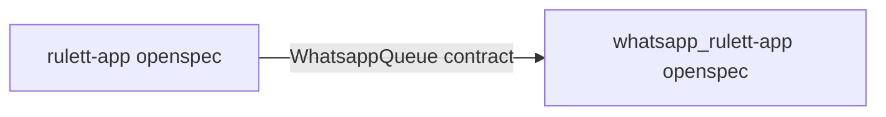

# Design: Fundación OpenSpec (worker)

**ID:** `001-openspec-foundation`

## Alineación cross-repo

El worker documenta **solo** lo que posee: claim, envío Meta, estados. Reglas de negocio de plantillas viven en rulett-app.

## Mapeo legacy

| Origen | Destino |
|--------|---------|
| `docs/ARCHITECTURE.md` | `specs/system_architecture.md` + `integrations.md` |
| `docs/DATABASE.md` | `specs/domain_model.md` |
| `docs/DEPLOYMENT.md` | `specs/operations.md` (referencia) |

## ADR compartido

Ver ADR-001 en rulett-app (`001-openspec-foundation/adr.md`) — misma decisión OpenSpec in-repo.
