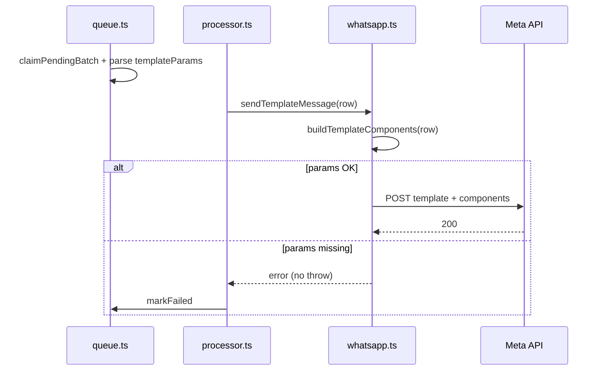

# Design: `templateParams` en worker

**ID:** `002-whatsapp-template-params`

## Flujo

## Mapeo components

| JSON key | Componente Meta |
|----------|-----------------|
| `nombre_tenant` | `header` / `parameter_name` |
| Otras claves | `body` / `parameter_name` cada una |

Orden de body: estable según implementación en `whatsapp.ts`.

## Archivos

- `sql/schema.sql` — `templateParams JSONB`
- `src/db/queue.ts` — SELECT + JSON.parse
- `src/types.ts` — `WhatsappTemplateParams`
- `src/services/whatsapp.ts` — `buildTemplateComponents`

## ADR

Ver rulett-app ADR-002: app pre-calcula; worker solo entrega.
