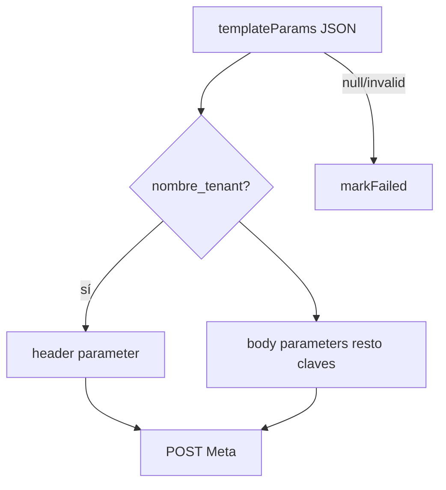

# Especificación: Integraciones

**Repositorio:** whatsapp_rulett-app

## Meta WhatsApp Cloud API

- **Versión:** Graph API v25.0
- **Endpoint:** `POST https://graph.facebook.com/v25.0/{WHATSAPP_PHONE_ID}/messages`
- **Auth:** `Bearer WHATSAPP_TOKEN`
- **Tipo mensaje:** `template` con `components` y `parameter_name`

### Construcción de components

## rulett-app (trigger)

| Variable | Uso |
|----------|-----|
| `WORKER_API_KEY` | Validar `Authorization: Bearer` en `/api/trigger` |
| Invocación | `POST /api/trigger` desde Vercel cron o admin |

## PostgreSQL (Neon)

- Misma `DATABASE_URL` que rulett-app
- SSL auto según host
- Pool `pg` max 10 conexiones

## Render

- Web Service con puerto HTTP
- Health check: `GET /health`
- Build: `npm install && npm run build`
- Start: `npm start`
